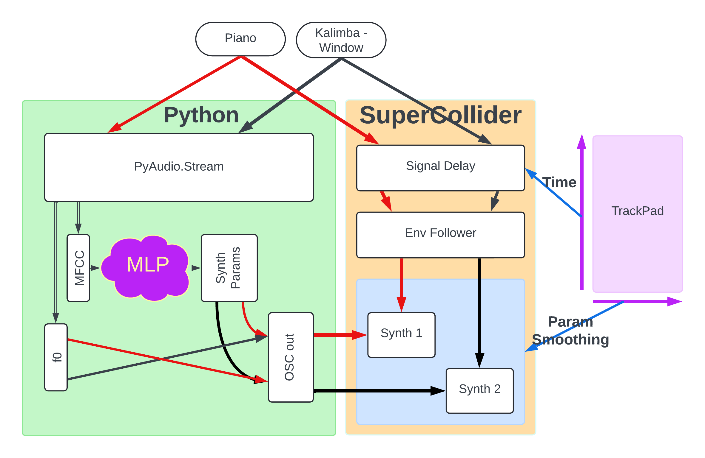

# FDBK: An Interactive Synthesis System for Human-Machine Real-time Improvisation.

## Acknowledgements

This project was developed in the context of the Generative Music AI workshop hosted by The Sound of AI and the Music Technology Group at the Universitat Pompeu Fabra, in June 2024.

Devs: Francesco Ardan Dal Ri and Andreas Papaeracleous.

Musicians: Luca Forcucci and Laura Lopez.

## Requirements:

Python 3.10 and SuperCollider.

SuperCollider Library: FluCoMa.

Python libraries: Numpy, Librosa, Essentia, PyTorch, TQDM, Pandas, Einops.

If using conda, the simplest way to get your environment running is to use the `environment.yml` file like so:

`conda env create -f environment.yml`

This will create a conda environment on your machine called FDBK. Activate it as you would other envs:

`conda activate FDBK`.

note that you'll still have to install FluCoMa in Supercollider.

## Usage

### Creating the dataset:

You'll need to create the dataset. The dataset comprises of audio files that you'll generate by using the `fdbk_train.scd` supercollider script. This process will synthesise samples using random synthesis parameters an record them to a folder. This process takes time. You can mute your computer for this process.
When done, you should have a folder of audio files and an accompanying parameters.json.

### Preprocessing and training:

You need to preprocess the audio using `create_dataframe.py` then `normalise_dataframe.py`, making sure to edit the pathnames in the headers.
You can then proceed to training using `training.py`.

### Performing:

To perform, you'll need to run audioStream.py, which will listen to your default audio input device, and send messages over OSC.

You then use the `fdbk_perform.scd` SuperCollider script.
Call the SynthDef, Instantiate the instances of left and right, then trigger the OSC Listeners at the bottom.

### System Architecture:

## Editing the scripts:

It's encouraged that you play around with the synthesis engines to match your sound. We were performing on a piano VST, an augmented kalimba and a contact-miked window.

To do so, you'll need to modify the `fdbk_synthdef.scd` script with the new synthesiser. Make sure to edit the necessary variables in the other two `.scd` scripts to match your changes. Keep track of how many parameters you want to learn, as you'll need to edit both `Network.py` scripts to have the layer count to match that number.
